<!-- _class: cover -->
<!-- _backgroundColor: #2b5b8c -->
<!-- _backgroundImage: "radial-gradient(circle at 45% 100%, #6fa8c8 0%, #2b5b8c 55%, #1d3f63 100%)" -->
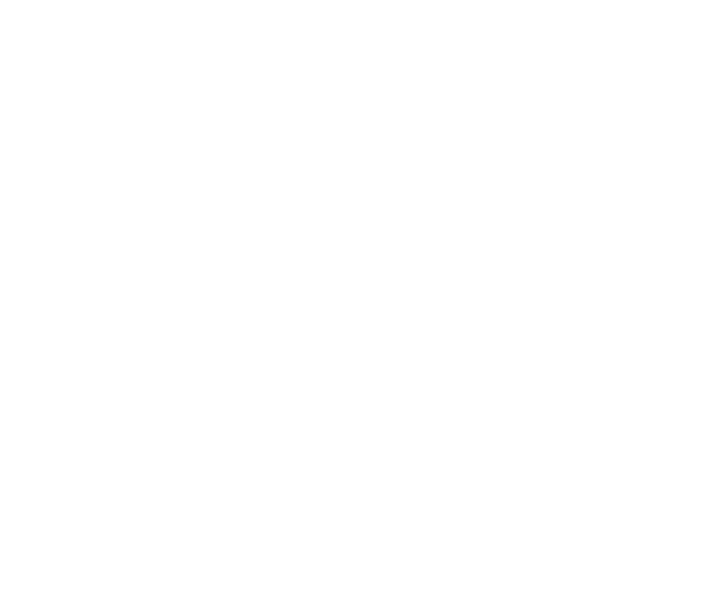
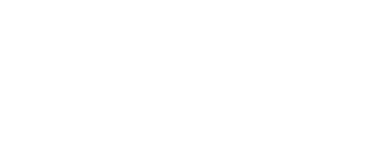
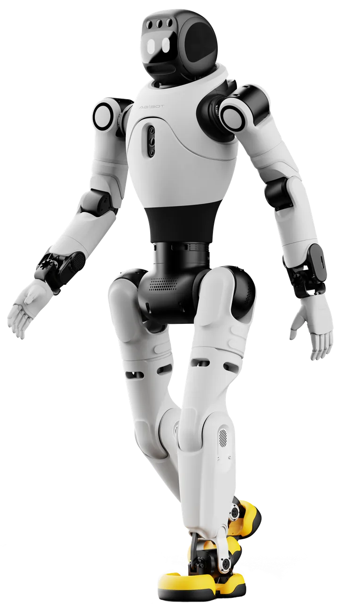

---

# Quiénes somos
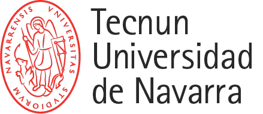

Grupo multidisciplinar que investiga y desarrolla soluciones de **robótica**, **automatización** y **sistemas mecatrónicos** para la industria del futuro.

Trabajamos en robótica industrial y colaborativa, robótica móvil y tecnologías hápticas, integrando *control avanzado*, *IA*, *visión artificial*, *realidad aumentada* y *gemelos digitales*.

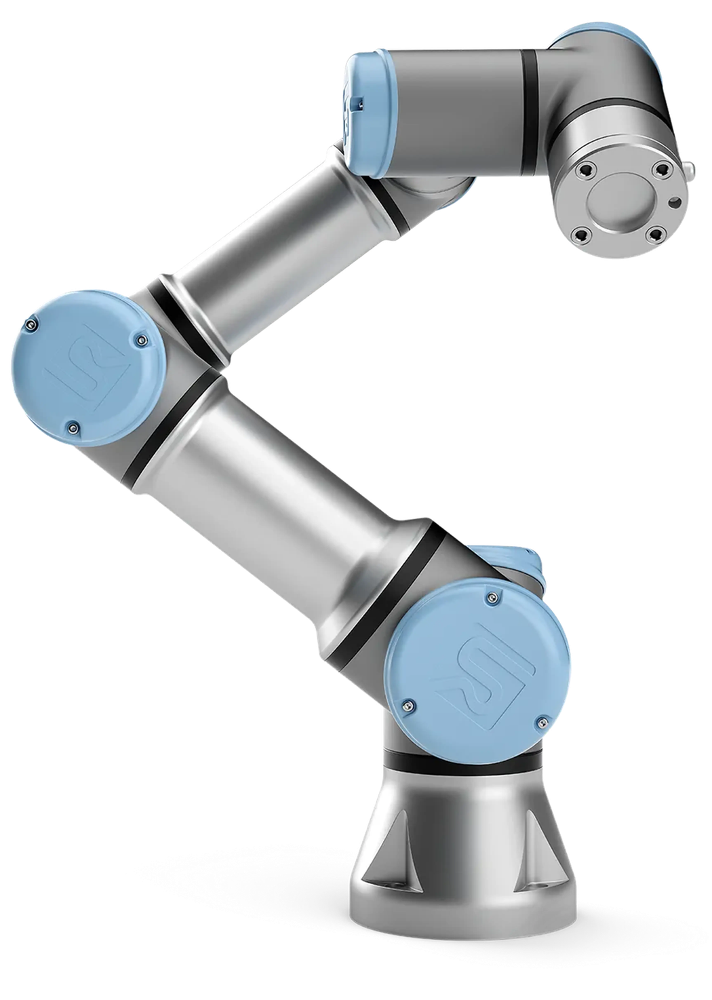

---

# Visión general del grupo

<h3>Personas</h3><ul><li>Investigadores actuales</li><li>Doctorandos actuales</li><li>Incorporaciones previstas</li></ul>

<h3>Investigación</h3><ul><li>Robótica y control</li><li>Mecatrónica</li><li>IA y visión artificial</li><li>Tecnologías hápticas</li></ul>

<h3>Proyectos</h3><ul><li>En curso</li><li>Propuestas previstas</li><li>Colaboraciones</li></ul>

<h3>Infraestructura</h3><ul><li>Robots y manipuladores</li><li>Visión y sensores</li><li>Control y automatización</li><li>Simulación</li></ul>

---

<!-- _class: people -->
# Investigadores y doctorandos

| Persona | Perfil | Línea / actividad | Situación |
|---|---|---|---|
| Sebastián Gutiérrez  | Investigador/a ♪ | Robótica · Control · IA | Tecnun |
| Jorge Juan Gil  | Investigador/a | Robótica · Control · IA | Tecnun |
| Diego Borro Yagüez  | Investigador/a ↑ | Visión · IA | Tecnun |
| Iñaki Díaz Garmendia  | Investigador/a | Robótica · Control | Ceit |
| Emilio Sánchez Tapia  | Investigador/a | Robótica | Ceit |
| Wilson Brian Mesa  | Doctorando/a ↓ | Robótica · Control | Tecnun |
| Julie Laurent  | Técnico/a | Robótica | Tecnun |

**Plan de crecimiento del grupo (2026-2030)**
- 3 nuevas incorporaciones de doctorado DESEABLE
- 1 perfil estratégico en Robótica e IA (Técnico de Laboratorio) DESEABLE

♪ Responsable del grupo 
↑ Incorporación: ene. 2026 
↓ Finalización prevista: ene. 2027

---

# Líneas de investigación

- Robótica avanzada (industrial, colaborativa y humanoide)
- Automatización, control y sistemas autónomos
- Mecatrónica y sistemas inteligentes
- Visión artificial e inteligencia artificial aplicada
- Interacción humano-robot y tecnologías hápticas
- Gemelos digitales y simulación industrial
- IoT y sistemas conectados para Industria 4.0

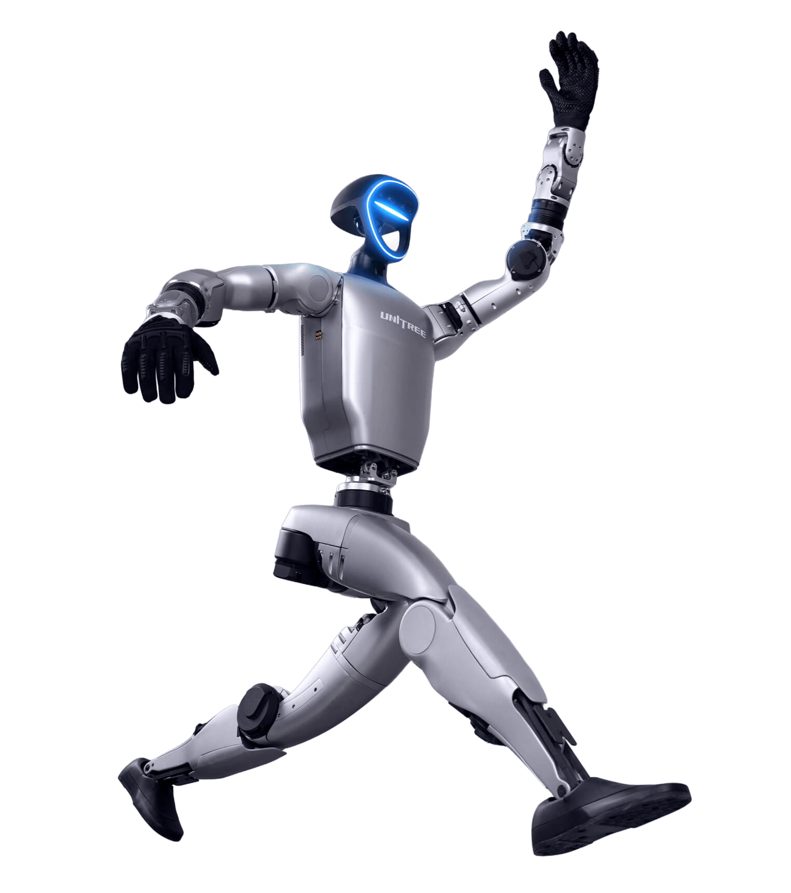

---

<!-- _class: projects -->
# Proyectos de investigación 2023 – 2026

| Nombre | Acrónimo | Rol | Convocatoria | Tipo | Importe | Inicio | Fin | Comentario |
|---|---|---|---|---|---|---|---|---|
| Learning-based Adaptive Robotic Reach with Unified visuo-tactile Architectures | LARRUA | Líder | PIBA 2026 | Regional | 80.000,00 € | | | Pendiente de resolución |
| Learning-based Adaptive Robotic Reach with Unified visuo-tactile Architectures | LARRUA | Líder | DFG Zientzia 2026 | Regional | 120.709,31 € | | | Pendiente de resolución |
| Investigación y desarrollo de tecnologías IA para dotar de máxima autonomía a la fabricación y reparación mediante procesos DED de piezas de gran tamaño y de alto valor añadido (FactorIA) | FACTOR(IA) | Part. | AEI - Transmisiones | Nacional | 328.609,50 € | 01/01/2025 | 31/12/2028 | Activo |
| PIUNA | PIUNA | Part. | | UNAV | | | | |
| Investigación de nuevos Modelos Reducidos basados en la física para la Digitalización Industrial (MoReDigital) | MoreDigi | Part. | Elkartek 2024 | Regional | 216.611,00 € | 01/04/2024 | 31/03/2026 | Finalizado |
| Beca Leonardo | | Líder | Becas Leonardo | Nacional | 50.000,00 € | | | Denegado |
| Investigación de nuevos Modelos Reducidos basados en la física, enriquecidos con DATos y Aprendizaje automático | MoreData | Part. | Elkartek 2026 | Regional | 598.165,07 € | | | Denegado |
| Diseño de algoritmos inteligentes para utilización en BESS | SMART BESS | Líder | DFG I+D 2025 | Regional | 94.413,00 € | | | Denegado |
| Métodos y algoritmos para la automatización en la digitalización holística inmersiva de la fábrica (LANVERSO) | LANVERSO | Part. | Elkartek 2022 | Regional | 83.478,00 € | 01/03/2022 | 31/12/2023 | Finalizado |

---

<!-- _class: equip -->
# Equipamiento actual

<h3>Robótica</h3><ul><li>Franka Emika Panda</li><li>Franka Research 3 (FR3)</li><li>Stäubli TX60</li><li>Fanuc LR Mate 200iB</li><li>Fanuc M-10iA</li><li>Gripper Robotiq</li><li>Robot cartesiano Aula Biele</li><li>Mitsubishi PA-10 (Descontinuado)</li></ul>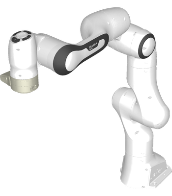

<h3>Visión</h3><ul><li>Intel RealSense D405</li><li>Sensórica</li></ul>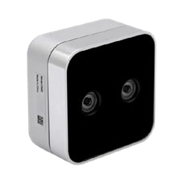<h3 style="margin-top:22px">Háptica</h3><ul><li>Phantom Premium 1.5</li><li>Phantom Premium 1.0</li><li>Phantom Omni ×3</li></ul>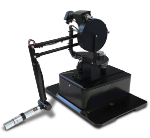

<h3>Control</h3><ul><li>PLC Beckhoff</li><li>Jetson Nano</li><li>Arduino R4 Wifi</li><li>Arduino Q</li></ul>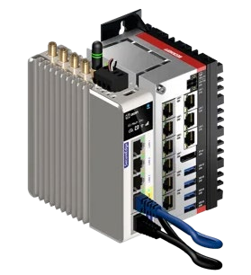

<h3>Simulación</h3><ul><li>RoboDK</li></ul>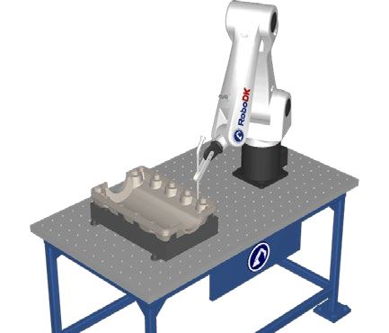

---

# Equipamiento previsto

<h3>Robótica avanzada</h3><ul><li>Robot humanoide para docencia / investigación</li><li>Robot cuadrúpedo</li><li>Manos y grippers sensorizados</li></ul>
PRIORIDAD ALTA

<h3>Percepción e IA</h3><ul><li>Cámaras industriales</li><li>Sensores hápticos</li><li>Infraestructura GPU</li><li>Procesamiento de datos</li></ul>
PRIORIDAD ALTA

<h3>Laboratorio</h3><ul><li>Renovación de equipamiento obsoleto</li><li>Optimización del espacio para estudiantes</li><li>Infraestructura para investigación aplicada</li></ul>
PRIORIDAD MEDIA

---

# Objetivos estratégicos

👤
<b>Talento</b>Captar talento investigador

💻
<b>Proyectos</b>Impulsar proyectos y colaboraciones

🤖
<b>Infraestructura</b>Modernizar laboratorio y equipamiento

💡
<b>Investigación</b>Impulsar robótica, visión e IA

📖
<b>Transferencia</b>Transferir tecnología a la industria

Consolidar un grupo multidisciplinar de referencia en robótica, automatización e inteligencia artificial, capaz de generar conocimiento, formar talento y transferir tecnología a la industria.

---

<!-- _class: splash -->
<!-- _paginate: false -->
<!-- _footer: '' -->

---

# Club de Robótica

- Equipo de robótica de estudiantes de Tecnun, tutorizado por el grupo.
- Aplican robótica, electrónica, diseño mecánico e IA en proyectos reales con impacto social.

<b>R2-KT</b> · Robot para hospitales infantiles

<b>Drones autónomos</b> · Navegación, visión artificial e IA

<b>Robótica de rescate</b> · Robots autónomos para entornos complejos

En marcha &nbsp; En desarrollo &nbsp; Prevista

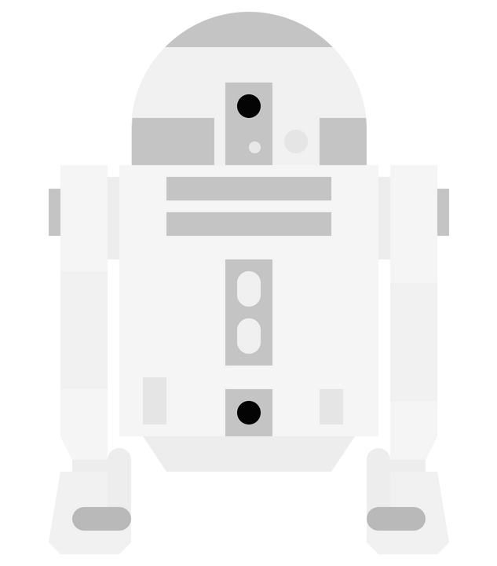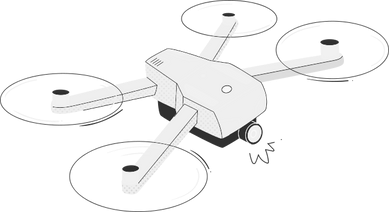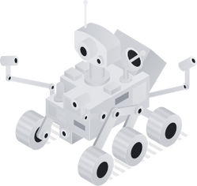

---

<!-- _class: cover -->
<!-- _backgroundColor: #e00000 -->
<!-- _backgroundImage: "radial-gradient(circle at 45% 100%, #ff2a2a 0%, #e00000 60%, #b80000 100%)" -->

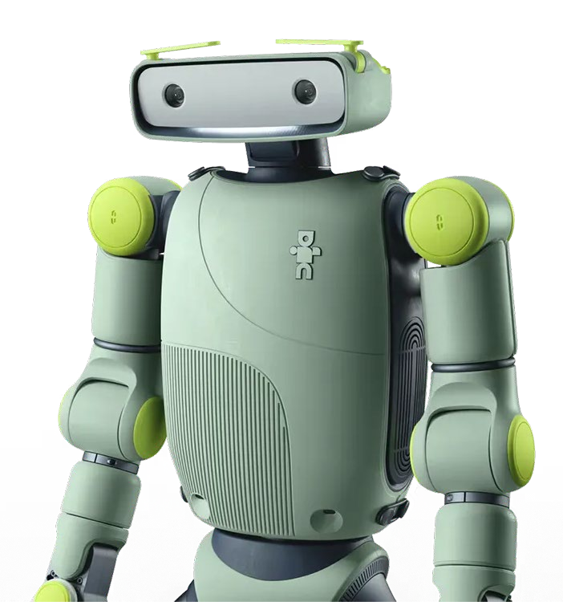
